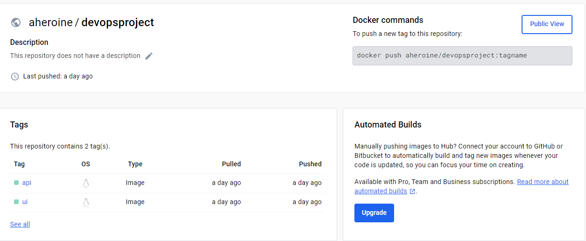

## DOCKER

## Prep: 

1. Prepare the Docker setup by installing the Docker dependencies.
    - `sudo apt update`
    - `git clone git@ssh.dev.azure.com:v3/ironhack-devops/Team2/Basic3Tier.API`

   (Otros comandos aquí están relacionados con la instalación de dotnet sdk y otras dependencias)

2. Install Docker and Docker Compose:
    - `sudo apt install docker docker.io`
    - `sudo apt install docker-compose`
    - `sudo usermod -aG docker squad`

3. After cloning the repositories and installing docker docker.io and docker-compose, we created the images used as a template to create the docker containers inside our VM:

   
   

4. Build Docker images:
    - `docker build -t .`
    - `docker build -t api`
    - `sudo docker build -t api`
    - `cd ..`
    - `cd Basic3Tier.Ui`
    - `cd Basic3Tier.UI`
    - `sudo docker build -t ui`

5. Docker login:
    - `docker login -u aheroine`
    - `sudo docker login -u aheroine`

6. Check Docker images:
    - `docker images`
7. Push the images to our Dockerhub repo to save it in case we need them in other projects

   

8. To make sure the connection to the database is correct yo have to check ther config.json file inside the app. You should see a connection string configuration specified for the database. If the connection is still not working, check the configuration string as much as needed, making sure that the host is your postgres-container, the port is 5432 and the database, user and password are correct. After checking this, delete and create once again the image of your backend and run the correspondent Dockerfile to create the container.

   
   

9. Lastly, instead of doing the whole process commented here manually, creating the two Docker images and pulling the postgres image followed by running containers. you can make everything at once to make everything more scalable, fast and simple. This is done through the docker-compose file configuratioon shown below and the following command:

    -`docker-compose up -d`
   
